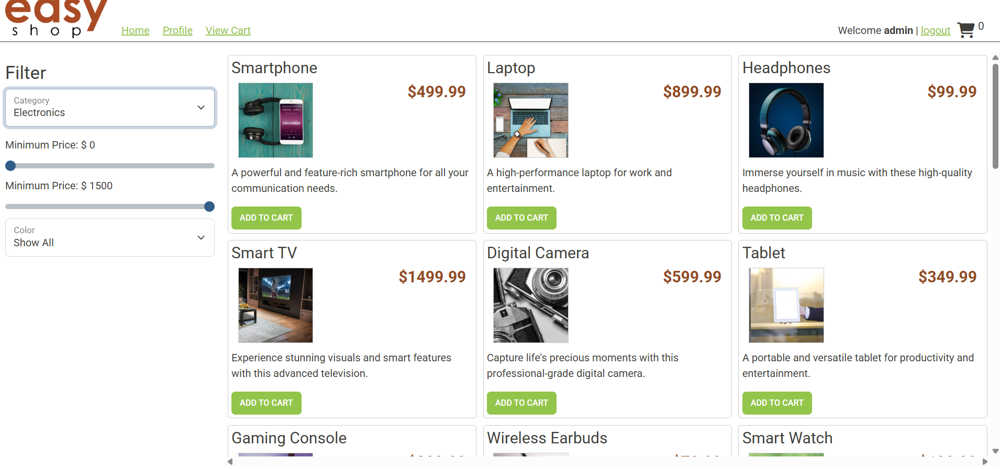
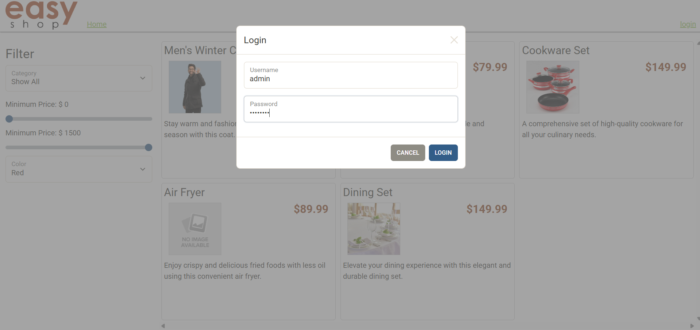
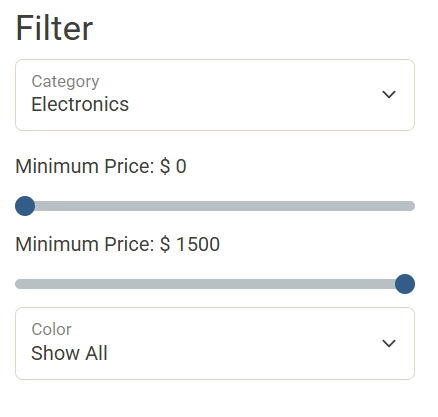
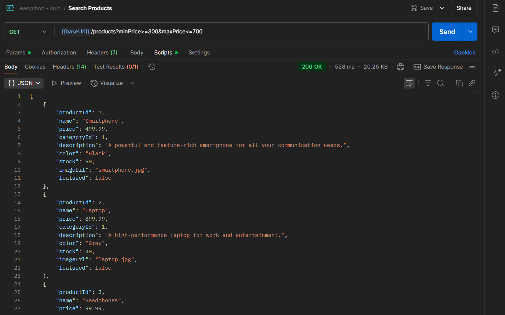
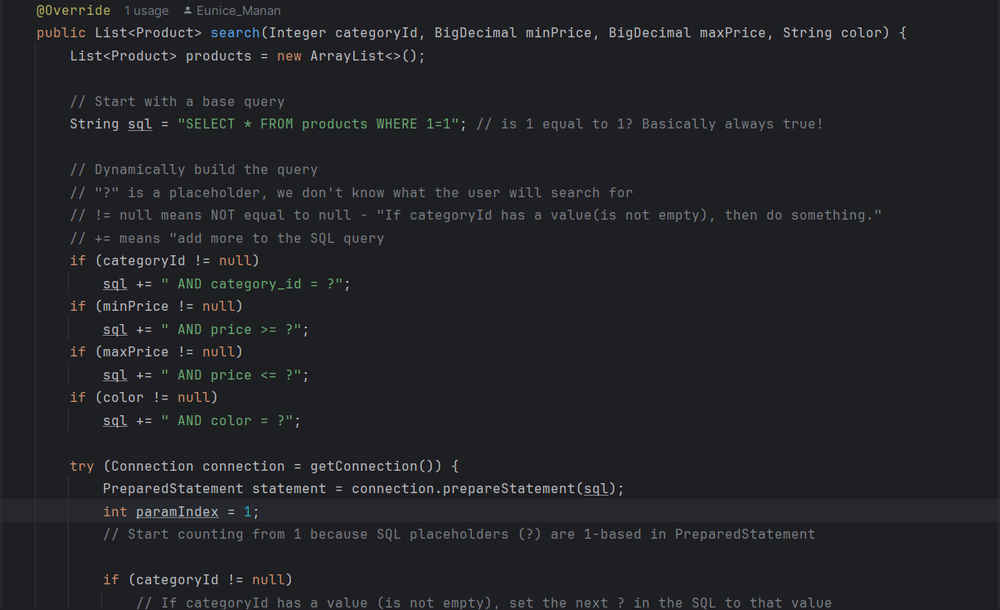

# 🛒 EasyShop E-Commerce API

Welcome to the EasyShop E-Commerce API, a Spring Boot backend project developed as part of the Capstone 3 solo project. This API powers an online store, enabling users to browse products, search and filter items, and manage categories and products through a secure, role-based system.

# 📌 Project Overview

This project simulates the backend development of an e-commerce platform. It is built using Java, Spring Boot, and MySQL, and is designed to support a front-end client and Postman for testing.

As the backend developer, I was responsible for:

- Fixing bugs in the existing product search and update logic.

- Implementing the full CategoriesController with secure admin-only access.

- Ensuring proper user authentication and authorization using JWT tokens.

# ✅ Features Implemented

- 🔐 User Authentication: Register and login with role-based access (USER, ADMIN).

- 🛍️ Product Browsing: View all products or filter by category, price, or color.
- 🛠️ Bug Fixes:
    -Corrected product search logic to return accurate results.
    -Fixed product update logic to prevent duplicate entries.
-📂 Category Management:
    -Admin-only access to create, update, and delete categories.
    -Public access to view all categories or a specific category by ID.

# 🧪 Testing

All endpoints were tested using Postman, with JWT tokens used for authenticated requests. Unit tests were written to validate bug fixes and controller logic.
This screenshot demonstrates how I used Postman to test the product search functionality of the EasyShop API. By sending a GET request with query parameters for minPrice and maxPrice, I verified that the API correctly filters and returns only the products within the specified price range. This kind of testing ensures that the dynamic SQL logic works as expected and that the backend handles user input securely and accurately.

# 🧠 Interesting Code Snippet

This method is a great example of writing flexible and secure backend logic. It dynamically builds an SQL query based on user-provided filters like category, price, and color. By using parameterized queries and tracking the parameter index with paramIndex, it ensures both safety from SQL injection and adaptability to different search scenarios. This makes the code not only functional but also scalable and easy to maintain.

# 📘 Project Summary & Reflection
This capstone project was my first experience building a backend API using Java, Spring Boot, and MySQL. I implemented core features like category management and product search, and I tested my endpoints using Postman. One of the most interesting parts was learning how to build dynamic SQL queries securely using parameterized inputs and managing parameter indexes correctly.

Although I struggled at times, especially with debugging and understanding how to structure dynamic queries, it was a valuable learning experience. I gained a deeper appreciation for how backend systems work and how important clean, secure code is in real-world applications.

I'm proud of what I accomplished and excited to keep learning. This project has motivated me to continue improving my skills and becoming a more confident and capable developer.